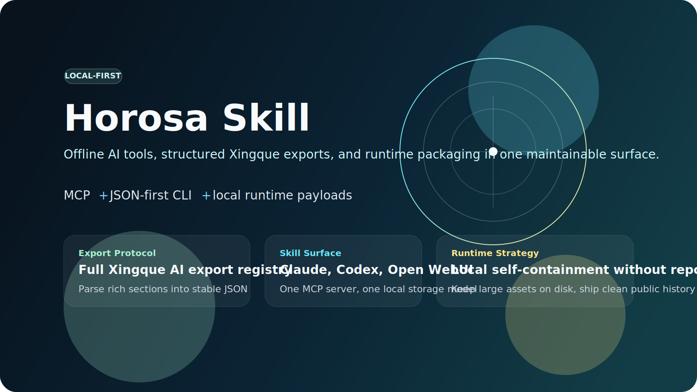

[简体中文](./README.zh-CN.md) | [English](./README.md)

<div align="center">
  <h1>Horosa Skill</h1>
  <p><strong>面向星阙 / Horosa 的本地优先 AI Skill 分发层。</strong></p>
  <p>让 Claude、Codex、Open WebUI、OpenClaw 这类 AI 可以通过 MCP 直接调用星阙的结构化玄学算法、完整 AI 导出协议与离线 runtime。</p>

  <p>
    <a href="https://github.com/Horace-Maxwell/horosa-skill">
      
    </a>
    <a href="https://github.com/Horace-Maxwell/horosa-skill/releases">
      
    </a>
    <a href="./README.md">
      
    </a>
  </p>

  <p>
    
    
    
    
    
    
  </p>
</div>



## 这个仓库是什么

Horosa Skill 的目标，是把星阙里最强的 AI 导出能力和本地算法能力，整理成现代 AI 能直接调用的接口层。

- 把完整的星阙 AI 导出文本解析成稳定 JSON
- 通过 MCP 和 JSON-first CLI 暴露结构化工具
- 把结果写入本地 SQLite 和 JSON artifact
- 从同一个本地项目文件夹打包离线 runtime
- 保持 GitHub 仓库整洁，同时保证你本地文件夹自包含

如果目标是“别人装一次后，AI 就能在本机直接调用真正的星阙算法，而且不再依赖外部服务”，这个仓库就是围绕这个目标设计的。

## 哪些东西放在哪里

这个项目刻意把两个概念分开：

| 区域 | 作用 |
| --- | --- |
| GitHub 仓库 | 公开代码、文档、CLI、MCP 接口、示例配置、发布脚本 |
| 本地项目文件夹 | 上述全部内容，以及离线打包所需的大体积 runtime 源文件 |

核心规则是：

- 运行和打包所需的 runtime 输入可以放在这个本地文件夹里
- 这些大文件不一定需要提交进 GitHub 历史
- 但打包脚本必须只依赖这个文件夹本身，不能再去旁边别的目录找东西

这也是 `vendor/runtime-source/` 存在的原因。

## Runtime 到底怎么放

这个项目里，runtime 只有三种正确位置：

| 场景 | runtime 放在哪里 | 要不要提交进 GitHub 仓库历史 |
| --- | --- | --- |
| 普通用户从 GitHub 安装 | macOS 放 `~/.horosa/runtime/current`，Windows 放 `%LOCALAPPDATA%/Horosa/runtime/current` | 不需要 |
| 维护者本地准备 release | 当前项目文件夹里的 `vendor/runtime-source/` | 默认不需要 |
| 面向最终用户公开分发 | GitHub Releases 的 runtime 压缩包和 release manifest | 需要，但作为 Release 资产，不是普通 Git 提交 |

实际含义就是：

- 普通用户 clone 仓库后，应该运行 `horosa-skill install`，从 GitHub Releases 下载对应平台 runtime
- 维护者为了打包方便，可以把大体积 runtime 输入留在本地 `vendor/runtime-source/`
- 仓库本身必须保持轻量，不能把完整离线 runtime 长期塞进正常 Git 历史

如果某个文件只是“打 runtime 包时要用”，那它应该待在本地 `vendor/runtime-source/` 或最终 Release 资产里，而不是默认进 GitHub 仓库提交。

## 为什么要做这个仓库

- 星阙现有的 AI 导出能力很强，但原始文本对 tool-calling 模型还不够友好。
- 普通用户不应该为了离线运行 Horosa，就必须拿到你的整个私有开发目录。
- 一个真正面向 AI 的公开仓库，必须有稳定的 schema、安装路径、runtime 方案和接入说明。

Horosa Skill 就是这层交付层。

## 核心能力

| 模块 | 作用 |
| --- | --- |
| 导出协议 | 把星阙 AI 导出规则公开成机器可读 schema |
| 导出解析 | 把星阙 AI 导出文本转成结构化 JSON |
| 工具层 | 提供 `horosa_dispatch` 和原子玄学工具 |
| AI 接入 | 支持 Claude、Codex、Open WebUI、OpenClaw 等 MCP 客户端 |
| 本地存储 | 结果进入 SQLite，并同步输出 JSON artifact |
| 离线打包 | 从本地 vendored runtime sources 直接打包 runtime payload |

## 快速开始

```bash
cd horosa-skill
uv sync
uv run horosa-skill doctor
uv run horosa-skill serve
```

默认 MCP 地址：

```text
http://127.0.0.1:8765/mcp
```

如果要给 Claude Desktop 这类 stdio 客户端使用：

```bash
cd horosa-skill
uv run horosa-skill serve --transport stdio
```

## 安装方式

如果你已经有 runtime archive：

```bash
cd horosa-skill
uv run horosa-skill install --archive /path/to/runtime-payload.tar.gz
uv run horosa-skill doctor
```

如果 runtime 通过 GitHub Releases 分发：

```bash
cd horosa-skill
uv run horosa-skill install --manifest-url https://example.com/runtime-manifest.json
uv run horosa-skill doctor
```

## AI 客户端接入

- [Claude Desktop 配置](./horosa-skill/examples/clients/claude_desktop_config.json)
- [Codex 配置](./horosa-skill/examples/clients/codex-config.toml)
- [Open WebUI 接入说明](./horosa-skill/examples/clients/openwebui-streamable-http.md)
- [OpenClaw 接入说明](./horosa-skill/examples/clients/openclaw-mcp.md)

## CLI 示例

导出完整星阙 AI export registry：

```bash
cd horosa-skill
uv run horosa-skill export registry
```

把星阙 AI 导出文本解析成结构化 JSON：

```bash
cd horosa-skill
echo '{
  "technique": "qimen",
  "content": "[起盘信息]\n参数\n\n[八宫]\n八宫内容\n\n[演卦]\n演卦内容"
}' | uv run horosa-skill export parse --stdin
```

直接运行原子工具：

```bash
echo '{"date":"1990-01-01","time":"12:00","zone":"8","lat":"31n14","lon":"121e28"}' \
  | uv run horosa-skill tool run chart --stdin
```

运行总调度器：

```bash
echo '{
  "query":"请做本命盘分析并给出主运势方向",
  "birth":{"date":"1990-01-01","time":"12:00","zone":"8","lat":"31n14","lon":"121e28"},
  "save_result": true
}' | uv run horosa-skill dispatch --stdin
```

## 仓库结构

| 路径 | 作用 |
| --- | --- |
| [`horosa-skill/`](./horosa-skill) | Python 包、CLI、MCP server、测试、示例配置、发布脚本 |
| [`docs/`](./docs) | runtime 规范、发布说明、维护文档 |
| [`vendor/`](./vendor) | 本地离线打包所需的 runtime source 区域 |

维护者视角可看 [Repo Layout](./docs/REPO_LAYOUT.md)。

## 离线 Runtime 策略

这个仓库采用双层模型：

- GitHub 仓库保持轻量、清晰、可审查
- 完整离线 runtime 从本地文件夹内的 runtime sources 构建出来

本地 runtime 输入通常包括：

- Horosa 的 Python 算法层
- flatlib 和 Swiss Ephemeris 数据
- 星阙导出相关前端资产
- 内嵌 macOS Python runtime
- 内嵌 macOS Java runtime
- `astrostudyboot.jar`

详细说明见：

- [Offline Runtime Releases](./docs/OFFLINE_RUNTIME_RELEASES.md)
- [Runtime Manifest Spec](./docs/RUNTIME_MANIFEST_SPEC.md)
- [Vendored Runtime Sources](./vendor/README.md)

## 本地存储模型

结构化结果默认存储在本地：

- macOS / Linux: `~/.horosa-skill/`
- Windows: `%APPDATA%/HorosaSkill/`

每次运行会写入：

- run 元信息
- tool call 记录
- entity 索引
- `runs/<YYYY>/<MM>/<DD>/` 下的 JSON artifact

## 当前状态

已经完成：

- 结构化 export registry
- 结构化 export parser
- CLI 和 MCP 接口
- 本地 memory store
- runtime install、doctor、stop 命令
- runtime 启停管理
- macOS 本地 runtime 打包链
- Windows runtime scaffold 和 release helpers

仍在推进：

- 真正可发布的 Windows runtime payload
- 覆盖所有前端本地算法的 headless JS runtime
- 正式 GitHub Releases 发布流程

## 设计参考

这个仓库的方向，参考了高完成度开源项目的呈现方式，也参考了你自己 `portpilot` 那种产品型仓库结构：

- [supabase/supabase](https://github.com/supabase/supabase)
- [shadcn-ui/ui](https://github.com/shadcn-ui/ui)
- [n8n-io/n8n](https://github.com/n8n-io/n8n)
- [open-webui/open-webui](https://github.com/open-webui/open-webui)
- 你自己的 `portpilot` 仓库在 hero、双语 README、产品化 framing 上的做法

## Contributing

见 [CONTRIBUTING.md](./CONTRIBUTING.md)。

## Security

见 [SECURITY.md](./SECURITY.md)。
