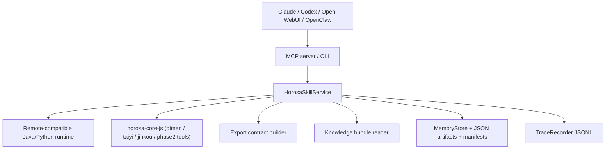

# Architecture

## 总览

Horosa Skill 由五层组成：

1. Python skill surface
2. Java / Python / Node runtime
3. Xingque export protocol layer
4. Local memory + trace
5. Bundled hover knowledge

## 结构图

## 核心模块

- `src/horosa_skill/service.py`
  - 调度 tool、dispatch、export contract、memory write-back
- `src/horosa_skill/runtime/manager.py`
  - install / doctor / start / stop
- `src/horosa_skill/knowledge/store.py`
  - 本地悬浮知识读取
- `src/horosa_skill/memory/store.py`
  - SQLite + JSON artifact + run manifest
- `src/horosa_skill/tracing.py`
  - trace / group / workflow JSONL

## 数据流

- tool run
  - 输入 schema 校验
  - runtime / local engine 执行
  - export_snapshot + export_format
  - trace 记录
  - artifact / manifest 写入
- dispatch
  - 自然语言选工具
  - 共享 group_id
  - 子工具各自 trace_id
  - 汇总 export contract
